# Brim Challenge - Masterminds

## Learning Room: https://tryhackme.com/room/brim
You should note that this is **NOT** a tutorial on Brim, but a walkthrough of the **challenge** room. If you need to lead what Brim is and how to use it, refer to the **Learning Room** link.

## Challenge Room: https://tryhackme.com/room/mastermindsxlq

The goal of this challenge is to practise analysing malicious traffic using Brim.

### TASK 1:

Task one involved setting up and deploying the VM. I will skip this and get right into actually using Brim.

### TASK 2:

#### Q1:

Let’s start off by loading the **infection1** packet capture (.pacp) into Brim.

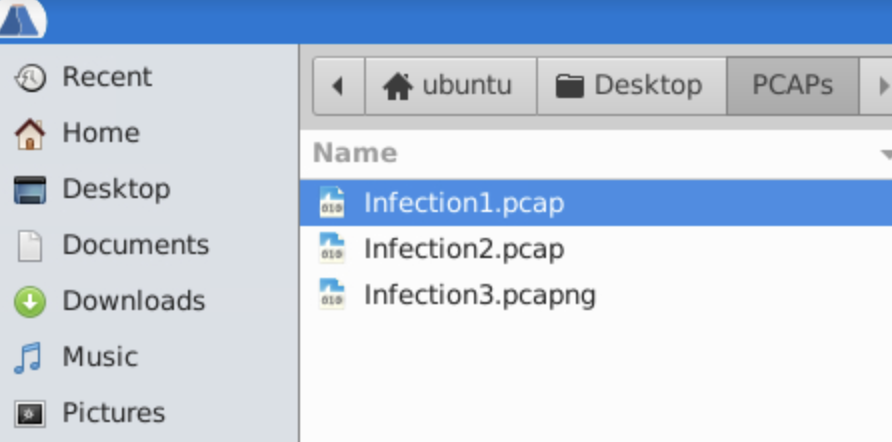

We will then continue by then looking at the “conn” logs to try and specify out victims IP address. I used the search query `_path == “conn” | cut id.orig_h,id.resp_h` and got the following:

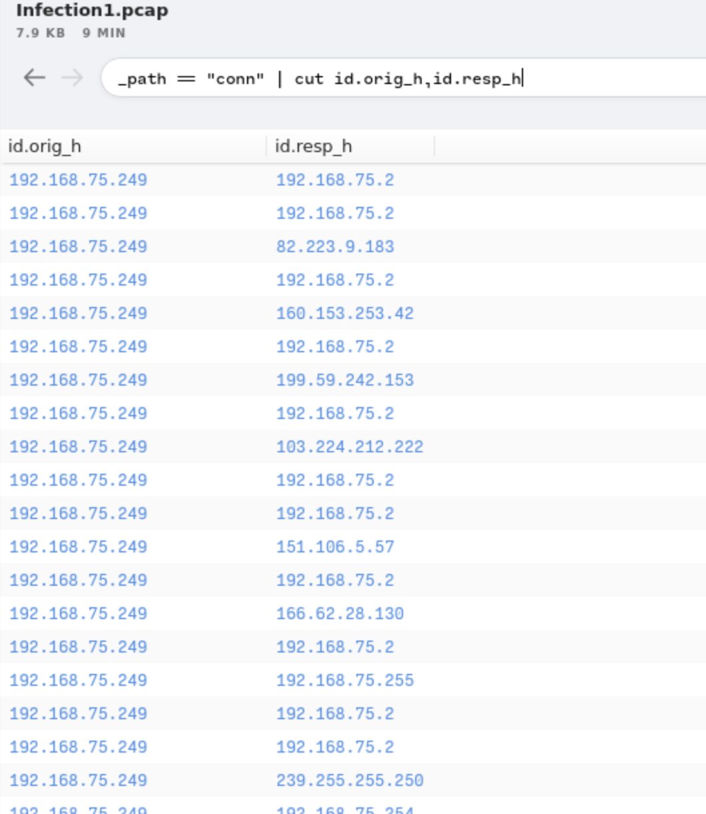

As we can see, there seems to be a lot of outgoing connections from **192.168.75.249** which is the answer to the first question.

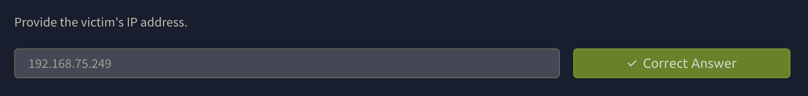

#### Q2:

I use the search query `_path=="http" | cut id.orig_h, id.resp_h, id.resp_p, method,host, uri, status_code | uniq -c` to search for the unique http connections and their **status codes**.

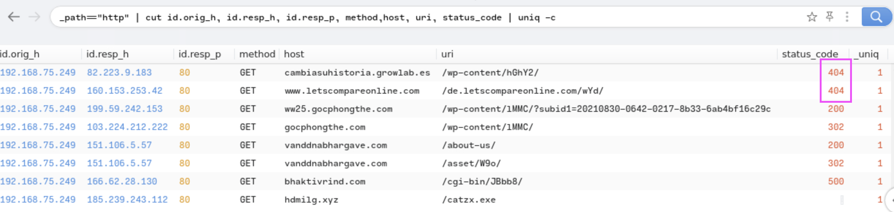

As we can see on the left hand side, we see two HTTP requests resulting in a **404** not found. We can then look in the host field (field just means column) to find our two domains.

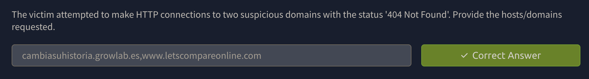

#### Q3:

I use the query `_path=="http" and response_body_len == 1309 | cut id.resp_h,host` to search for the http logs which have a response body length of 1309 (as specified by the question)

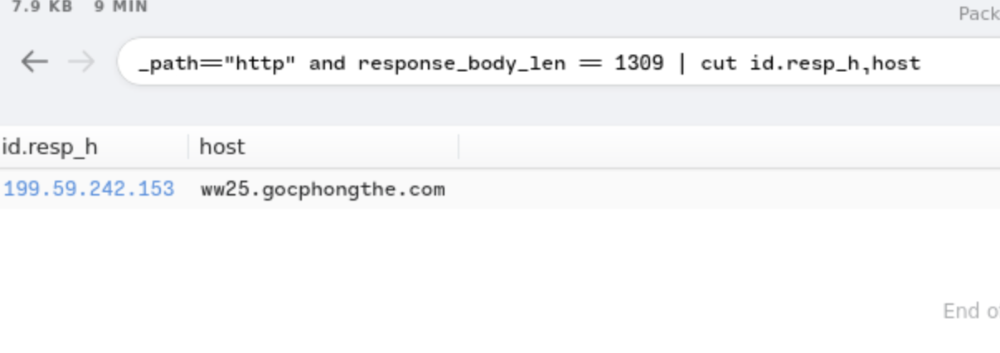

As we can see the **id.resp_h** field (which is just destination IP) we have what seems to the attackers IP. We can also see the domain name next to it.

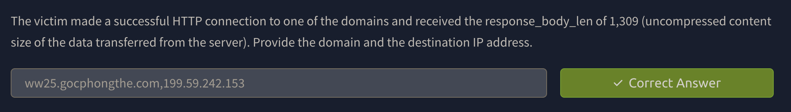

#### Q4

I first filter by the unique DNS Queries with` _path=="dns" | count() by query | sort -r` and get the following output:

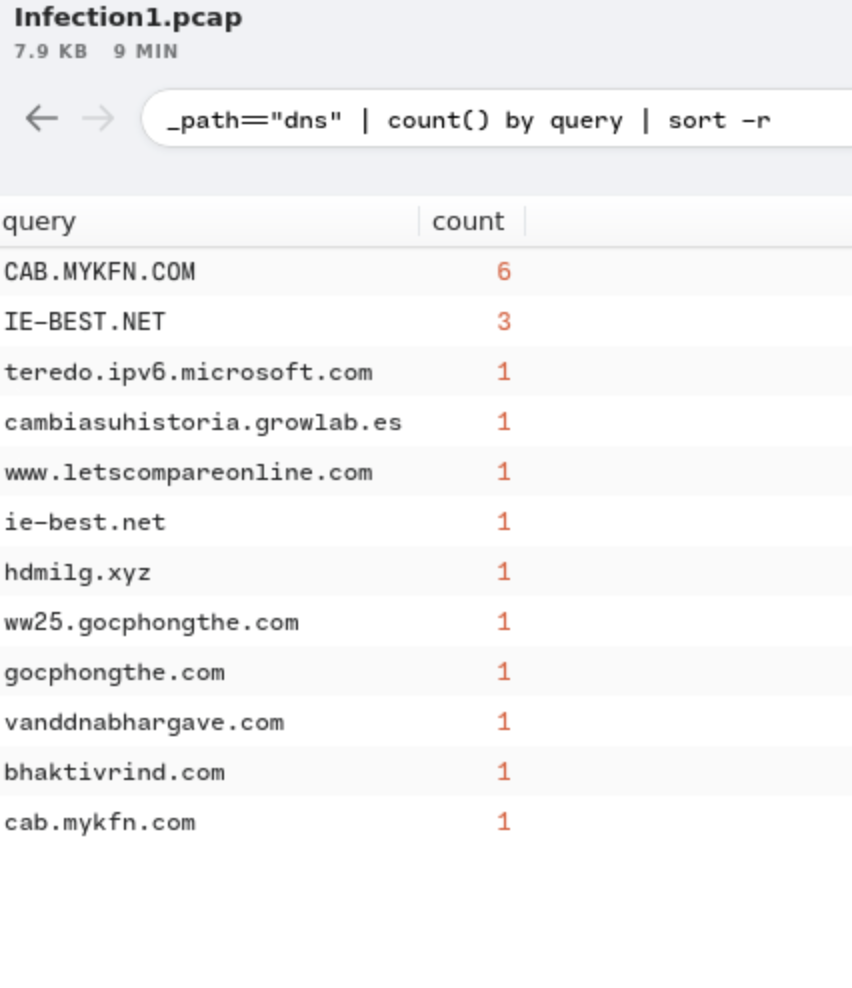

The first and last query are pretty much duplicates however with different capitalisation. 6 + 1 = 7 total queries.

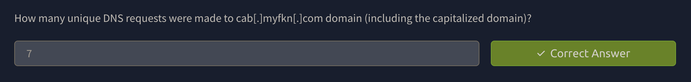

#### Q5

I decide to filter by the host here. I used the query `_path=="http" and host == "bhaktivrind[.]com”` (note this is defanged here but not in the actual query).

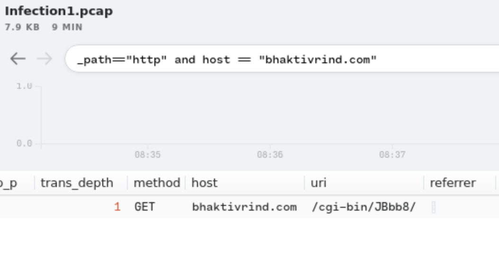

As we can see from the output, we have the answer under the "uri" field.

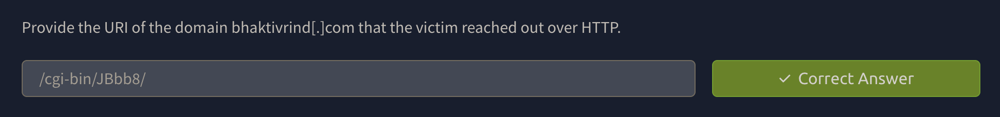

#### Q6:

First let's query for the unique http requests with `_path=="http" | cut id.orig_h, id.resp_h, id.resp_p, method,host, uri | uniq -c`. We see the following response:

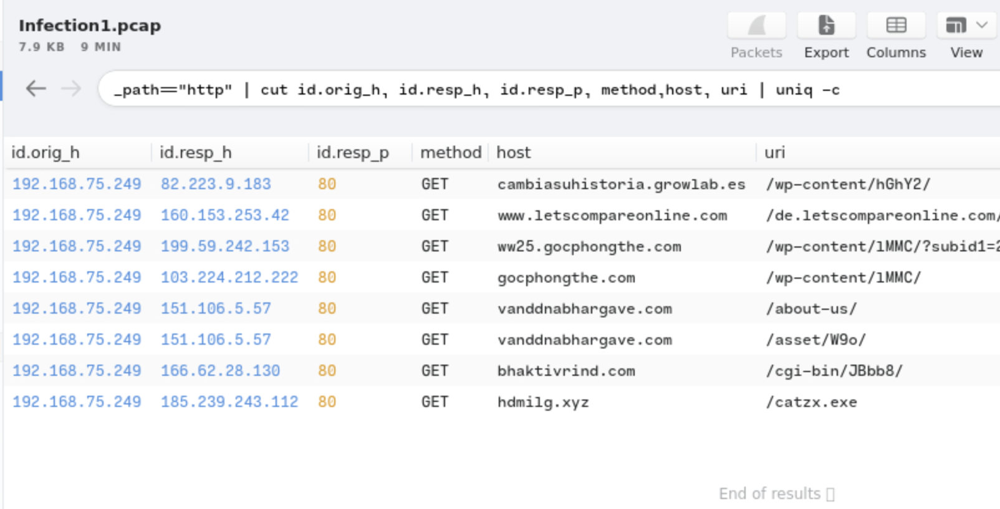

As we can see, there is a suspicious **catzx.exe** comming from the IP ending in 112 (id.resp_h).

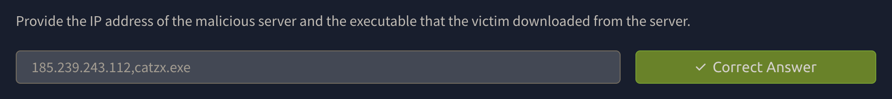

#### Q7:

From the second question (Q2), we found the **cambiasuhistoria(.)growlab(.)es** domain. Let’s search for it in Virus Total

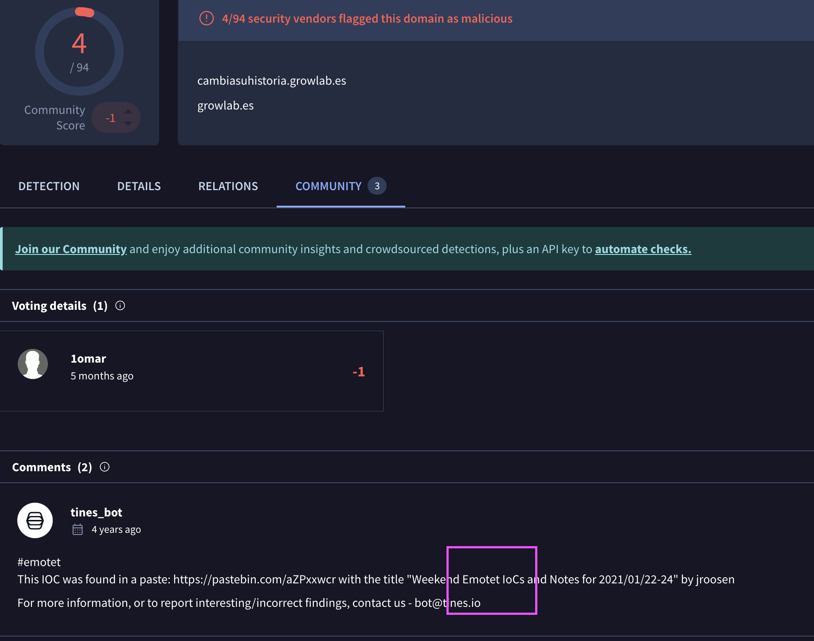

As we can see under the community tab, we have our answer "Emotet".

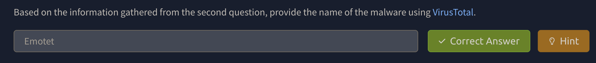

### TASK 3:

### Q1:

After loading up the “Infection2.pcap” file I search for the unique network connections using the query `_path=="conn" | cut id.orig_h, id.resp_p, id.resp_h | sort | uniq` and get the following:

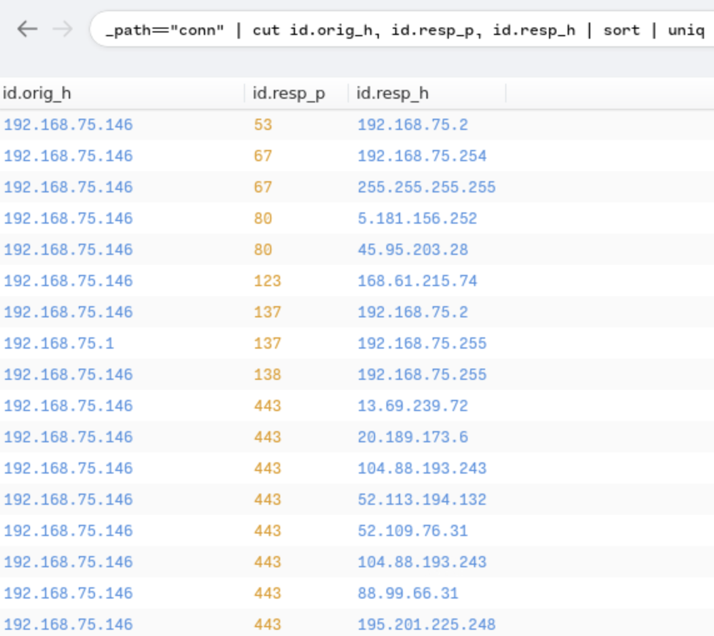

As we can see there are a-lot of established connection involving 192.168.75.146, let's try that as the answer.

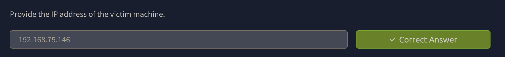

### Q2:

I use the query `method="POST | cut ts, uid, id, method, uri, status_code` to find the unique POST requests made.

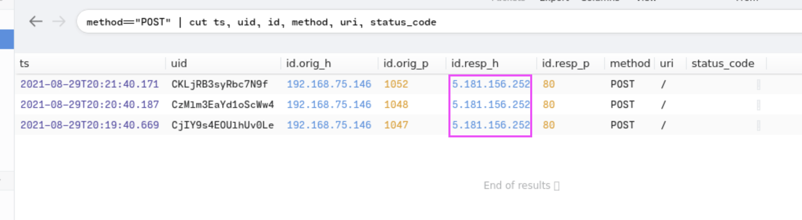

As seen under the **id.resp_p** field, we can see the IP the victim has been making POST requests to.

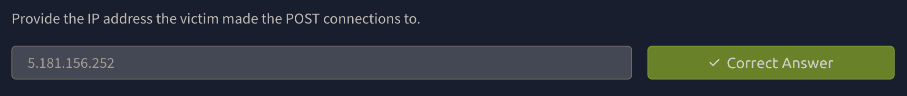

#### Q3:

Using the same query we can see how many times the request was made by the victim.

#### Q4:

Let's query for the http requests made with `_path=="http" | cut id.orig_h, id.resp_h, id.resp_p, method,host, uri | uniq -c`. We get the following result:

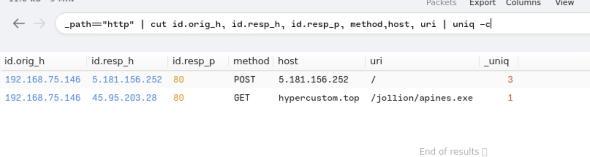

As we can see in the **host** field, there was a suspicious request to a domain downloading a .exe file.

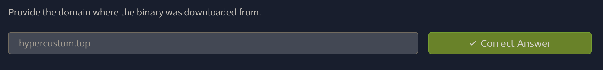

#### Q5:

Using the same query we can also identify the name and full URI of the binary (exe file).

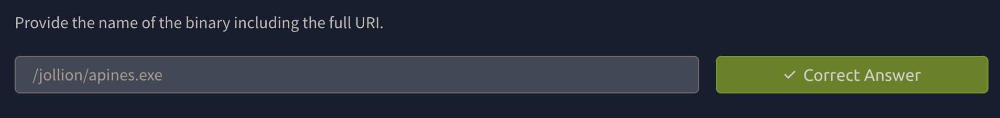

#### Q6:

Again using the same query, we are able to find the IP under the **id.resp_h** field.

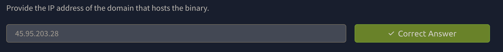

#### Q7:

I view the alerts with the query `event_type=="alert" alert.severity==1 alert.category=="A Network Trojan was detected"` and get:

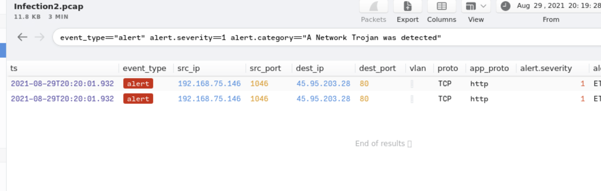

As we can see in the response, there were two requests made from the same host.

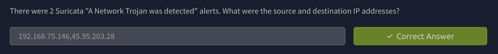

#### Q8:

After heading to **URLhaus** and pasting in the domain I get the following results:

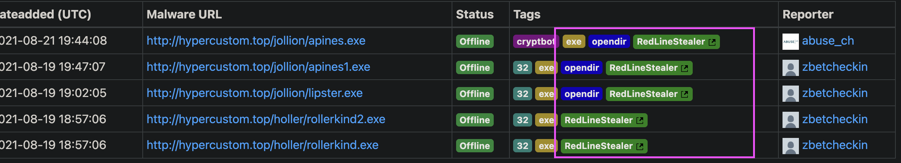

As seen in the tags section, it seems to be named "RedLineStealer".

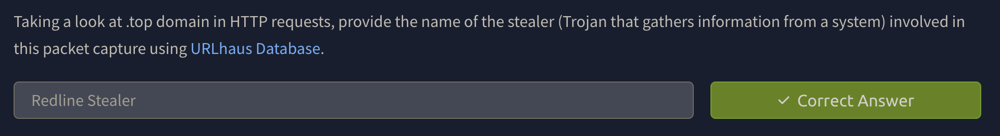

### TASK 4:

#### Q1:

I use the same query to find the unique network connections `_path=="conn" | cut id.orig_h, id.resp_p, id.resp_h | sort | uniq`.

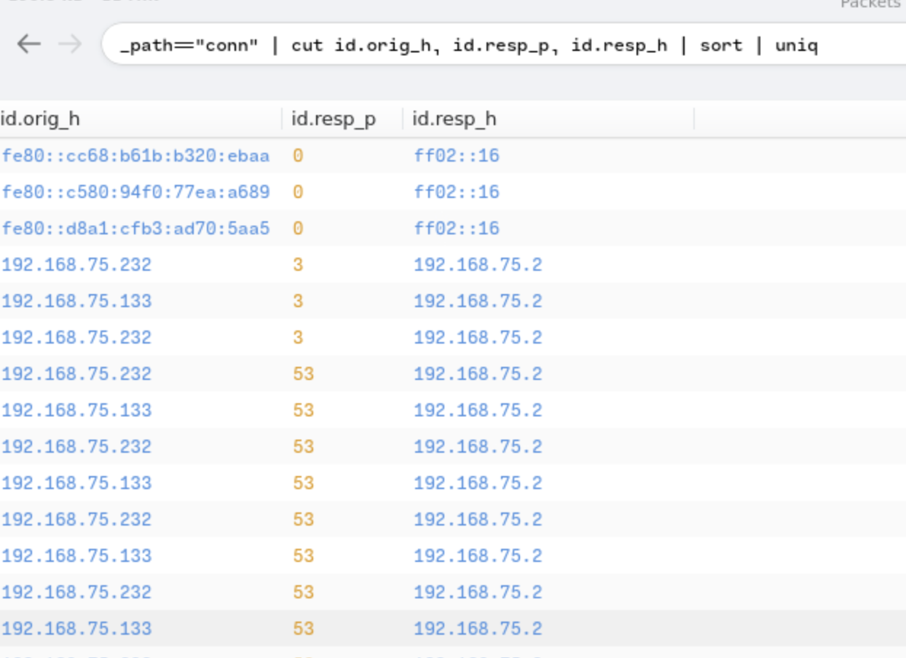

Looking at the **id.orig_h** field, we can see many established connections involving the IP ending in .232

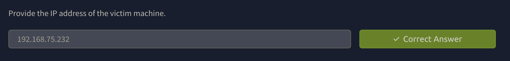

#### Q2:

I use the same query we have been using to find the unique network connections `_path=="conn" | cut id.orig_h, id.resp_p, id.resp_h | sort | uniq` and get:

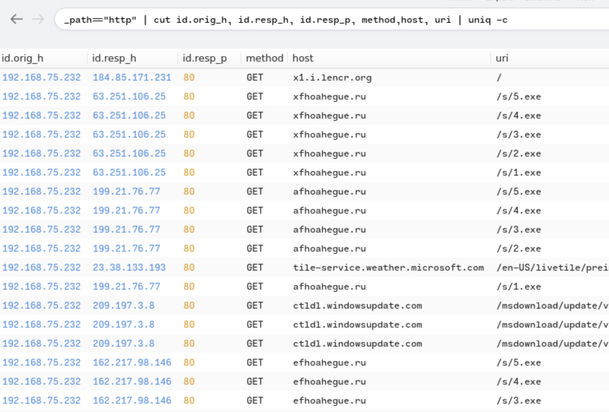

We can see there are many numbered **.exe** files being downloaded from very similar looking domain that are just starting with a different letter.

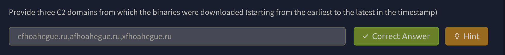

#### Q3:

Using the same query, we can also identify the three different IPs by looking in the **id.resp_h** field.

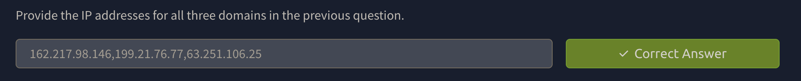

#### Q4:

I first query for unique domains and then search for our efhoahegue[.]ru with `_path=="dns" | count() by query | sort -r | efhoahegue[.]ru`

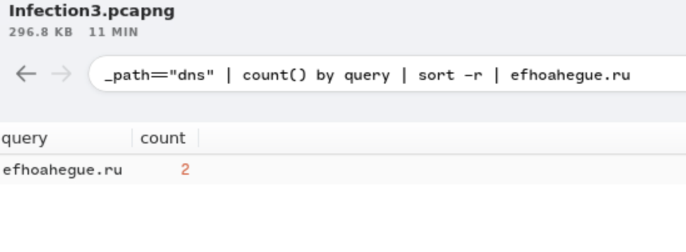

As we can see, there were two queries made to resolve this domain.

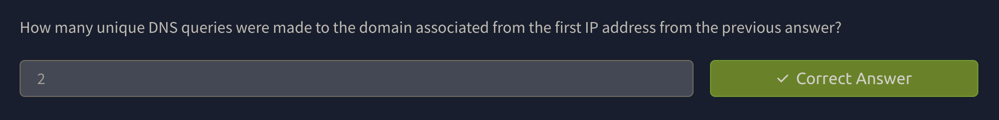

#### Q5:

Let’s use the query `_path=="http" | cut id.orig_h, id.resp_h, id.resp_p, method,host, uri | uniq -c` once more to find the different binaries being downloaded.

As we can see it's 1-5.exe meaning 5 different binaries are being downlaoded.

#### Q6:

I use the query `_path=="http" | cut host,user_agent | sort`  to easily see the user agent in the output.

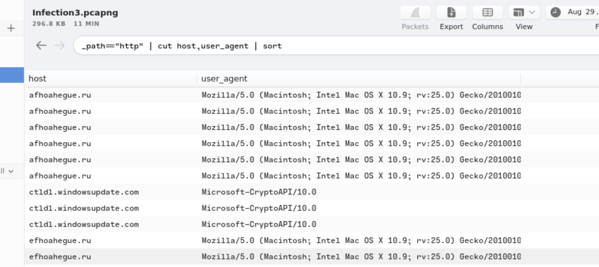

As seen in the user_agent field, it seems to be FireFox.

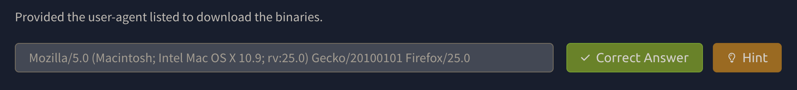

#### Q7:

I use the following query to find the total DNS queries`_path=="dns" | count()` and get the output:

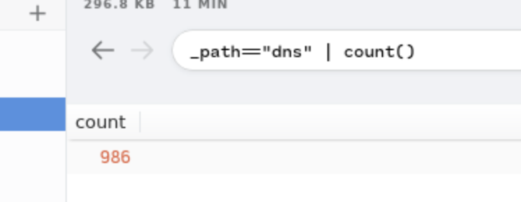

We get 986 DNS connections as our result.

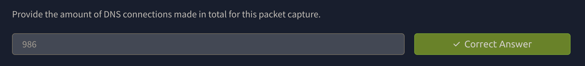

#### Q8:

I decide to paste the domain into **VirusTotal** and have a look in the community section. You could have just searched for “efhoahegue worm” in google and found the same result. Here is what I found in VirusTotal:

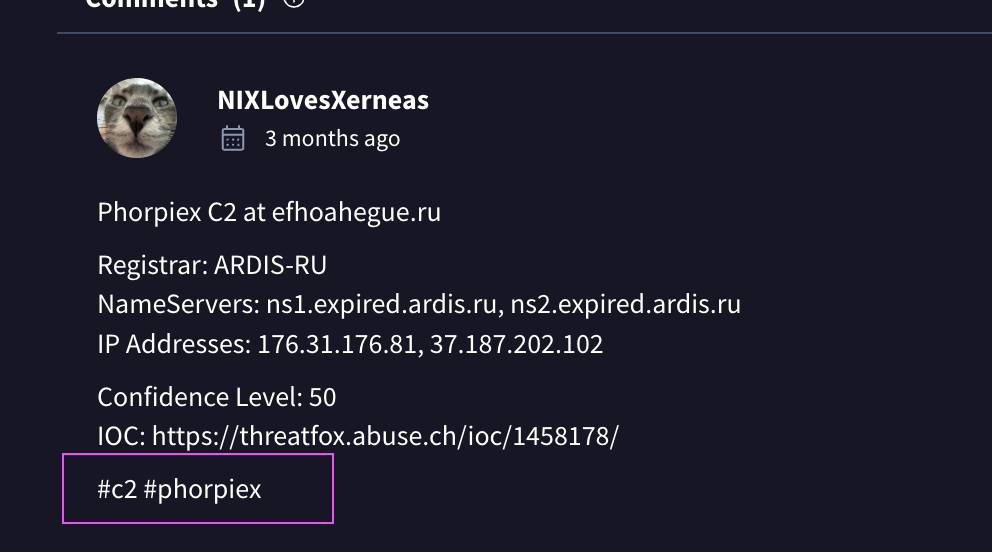

Down the very bottom we can see “phorpiex” which is close (but missing a letter). I then did a google search and found the missing ‘h’.

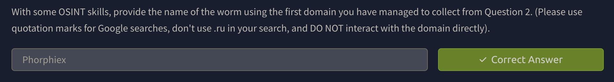

I hope you leaned a bit about Brim and thank you for reading.