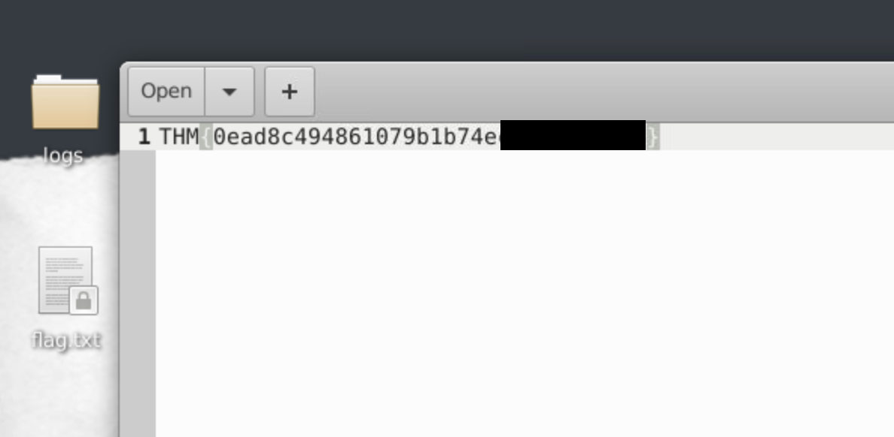

# Snort Challenges

## Learning Room: https://tryhackme.com/room/snort
You should note that this is **NOT** a tutorial on Snort, but a walkthrough of the **challenge** room. If you need to learn what Snort is and how to use it, refer to the **Learning Room** link.

## Challenge Room featured in the report: https://tryhackme.com/room/snortchallenges2

## Basic challenge room (no report on this one): https://tryhackme.com/room/snortchallenges1

This challenge was the second challenge in the Snort challenge series. This challenge revolved around SOC (blue teamers) defending against attackers which brute force ssh, and establish a reverse shell inside out network. We use snort to analyse raw network traffic, identify anomalies (attackers) and write snort rules to block them. As you may of guessed, Snort is a super powerful tool, its ability to act as an IDS **and** IPS is super powerful once you get the hang of it.

### Part 1:

We have been told that our network is being brute forced.

First, we must find out who is attacking us (IP) and the port they are attacking on (which also tells us what protocol they are attacking).

Let's start of my opening up Snort in packet sniffing mode and try to manually identify anything that may looks suspicious.
`sudo snort -v -l .`

After we have captured some traffic, lets continue by now analysing these logs which is done with the command:
`sudo snort -r snort.log.1750750062 -X`

As you may of noticed, we have some suspicious traffic coming in from 10.10.245.36 on port 46472 attaching machine 10.10.140.29 on port 22. If you are familiar with port number, we know that this is SSH which can be verified with the strings inside the payload (@openssh is everywhere).

Inside of our log directory, lets write a test rule and run snort in IDS mode to see if it catches the brute force attempts, the rule I wrote was:

`alert tcp 10.10.245.36 any -> any any (msg:"Bruteforce drop"; sid:1000001; rev:1;)`

Let's test that rule against the logs now, making sure it successfully identifies the malatious SSH packets.

`snort -c test.rules -r snort.log.1750750062 -A`

As we can see by the action stats, we are alerting to **300** packets according to our rule. It seems to be working fine.

Now lets edit this to make it actually **drop** the packets, meaning that they are not able to get into the network at all (IPS). We can simply modify the rule in vim (or whatever you like) by changing alert to drop:

`drop tcp 10.10.245.36 any -> any 22 (msg:"Block brute"; sid:1000001; rev:2;)`

Now, lets actually put the rule in place and turn Snort into a **IPS** rather than a boring on IDS. Let' place our rule into the actual snort configuration file  by going to: `/etc/snort/rules/local.rules` and inputting our new drop rule.

We can then put snort into **IPS** "mode" which will actively drop (block) the malicious packets. I did this with the command:

`sudo snort -c /etc/snort/snort.conf -q -Q --daq afpacket -i eth0:eth1 -A full

(Note here we are now using our config file and route our .rules)

That seemed to do it, we successfully blocked the SSH brute-force and got the flag.txt on our desktop.
#### Q1:

#### Q2:

As we saw previously, we know port 22 is SSH. However, we can grep out the logs to double check.

#### Q3:

We know that its port 22 and SSH is over TCP, however, if we are unsure we can grep what protocol is being used (in the logs)

### Part 2:

Now we have blocked the connection, we suspect that the attackers have compromised a machine and have set up a **reverse shell**. Let's scan our network using the packet sniffer to see if we see any suspicious traffic.

`sudo snort -v -l .`

Now after that has run, we will open up the logs:

As we can see, there seems to be some suspicious stuff coming from **10.10.144.156** on port **4444**. Port 4444 is quite suspicious as this is often used with a hacking framework **metasploit/msfvenom**. 

Let's grep out port 4444 and see if we see anything else to confirm our suspicions.

Yep... it does seem pretty weird, we have **very fast** back and forth communication and in large quantities. Let's write a test rule in a `test.rules` and throw it against the logs to see if it works.

I decide to make a bidirectional rule, meaning that this rule is looking for **incoming or outgoing** connections from 10.10.144.156 (and the 4444 port).

Let's throw it up against the logs, making sure everything is being detected as we hoped.

Great, looks like it is. Let's now write the rule into our actual real snort configuration file and set up snort in **IPS** mode.

`vim /etc/snort/rules/local.rules` and then `drop tcp 10.10.144.156 any <> any 4444 (msg:"Rev shell connection"; sid:1000001; rev:1;)`. 

Now lets put snort into IPS mode and see if we stopped the connection:

`sudo snort -c /etc/snort/snort.conf -q -Q --daq afpacket -i eth0:eth1 -A full`

#### Q1:

The flag that we got was the answer to the first question.

#### Q2:

We know that a reverse shell would need a TCP connection, and we already identified the attackers listener listening on 4444.

#### Q3:

As we identified, these types of tools like to run on ports like 4444. This can be found with some quick researching. 

Thanks for reading and hope you learned something.