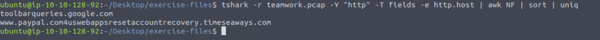
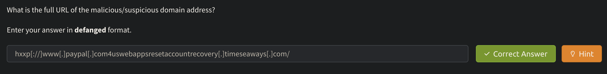
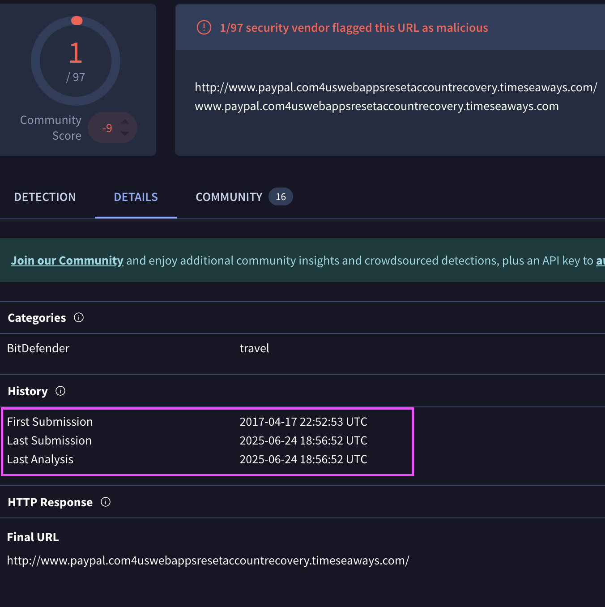
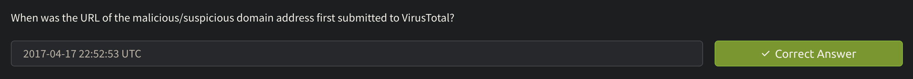
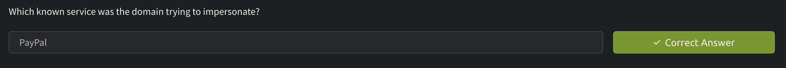
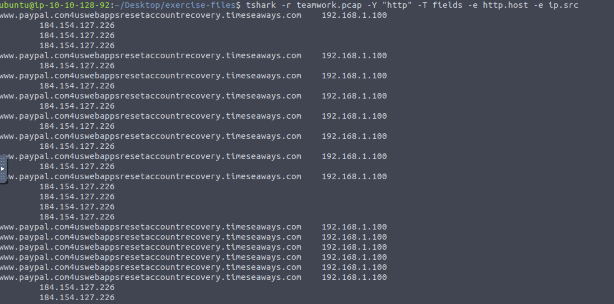
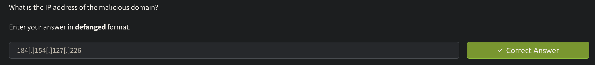
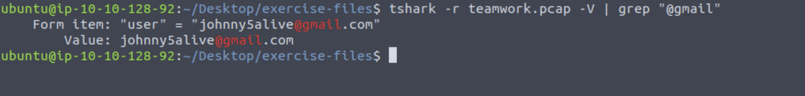

# TShark Challenge I: Teamwork

## Learning Room: https://tryhackme.com/room/tsharkthebasics
You should note that this is **NOT** a tutorial on Tshark, but a walkthrough of the **challenge** room. If you need to learn what Tshark is and how to use it, refer to the **Learning Room** link.

## Challenge Room: https://tryhackme.com/room/tsharkchallengesone

"This room presents you with a challenge to investigate some traffic data as a part of the SOC team. Let's start working with TShark to analyse the captured traffic."

### TASK 1:

Task one involved setting up and deploying the VM. I will skip this and get right into actually using Brim.

### TASK 2:

#### Q1 - What is the full URL of the malicious/suspicious domain address?

First to identify the URL I use the command `tshark -r teamwork.pcap -Y "http" -T fields -e http.host | awk NF | sort | uniq`.

As we can see, there seems to be a lot of suspicious URL's impersonating PayPal.

#### Q2 - When was the URL of the malicious/suspicious domain address first submitted to VirusTotal?:

Lets take this URI to www.virustotal.com and past it in:

As we can see under the **details** section, we have the history of the search.

#### Q3 - Which known service was the domain trying to impersonate?:

From answering Q1, we were able to identify that the domain was trying to impersonate PayPal.

#### Q4 - What is the IP address of the malicious domain?

I run the command `tshark -r teamwork.pcap -Y "http" -T fields -e http.host -e ip.src` to have a look at IP addresses sending information outbound.

We can see the IP address starting in "184".

#### Q5 - What is the email address that was used?:

Let’s search for common email domains using grep, I first tried **@gmail** to see if I could find anything. Using the command `tshark -r teamwork.pcap -V | grep “@gmail”` I get:

As we can see there is a email address from Johnny.

This was a very simple room, almost an introduction to *Tshark** if you have never seen it. The next room (Room II) will be more involved.