# TShark Challenge II: Directory

## Learning Room: https://tryhackme.com/room/tsharkthebasics
You should note that this is **NOT** a tutorial on Tshark, but a walkthrough of the **challenge** room. If you need to learn what Tshark is and how to use it, refer to the **Learning Room** link.

## Challenge Room: https://tryhackme.com/room/tsharkchallengestwo

“An alert has been triggered: "A user came across a poor file index, and their curiosity led to problems”.”

### TASK 1:

Task one involved setting up and deploying the VM. I will skip this and get right into actually using Brim.

### TASK 2:

#### Q1 - What is the name of the malicious/suspicious domain?:

After traversing to the exercise-file directory, I run `tshark -r directory-curiosity.pcap -Y "http" -T fields -e http.host | awk NF | sort | uniq
` to identify the http host names.

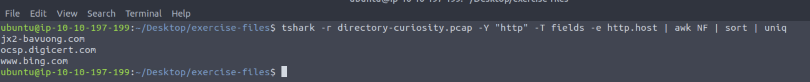

As we can see, there is some suspicious domain starting with “jx2”.

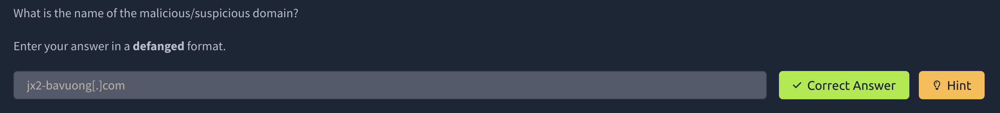

#### Q2 - What is the total number of HTTP requests sent to the malicious domain?:

Running the command `tshark -r directory-curiosity.pcap -Y http -T fields -e http.request.full_uri | sort | awk NF | grep "jx2" | nl` I get:

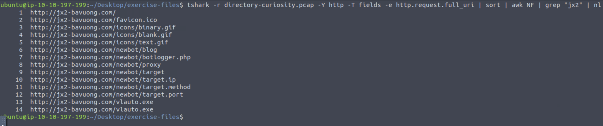

As we can see there were 14 requests made to this host.

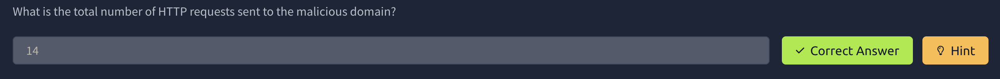

#### Q3 - What is the IP address associated with the malicious domain?:

To include the IP, I use the field ip.dst in the output with the command `tshark -r directory-curiosity.pcap -Y http -T fields -e http.request.full_uri -e ip.dst | grep "jx2"` and get:

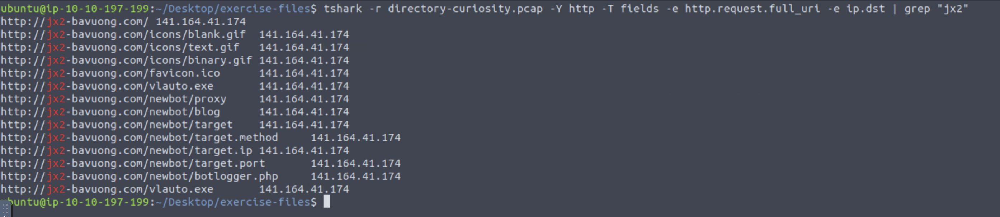

As we can see, the IP starting with 141 blogs to the suspicious domain.

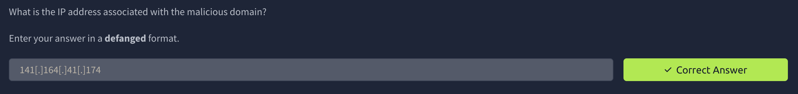

#### Q4 - What is the server info of the suspicious domain?

Running the command `tshark -r directory-curiosity.pcap -Y http -T fields -e http.server | awk NF` we get:

As we can see the server is Apache.

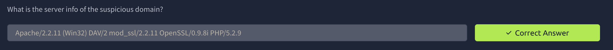

#### Q5 - Follow the "first TCP stream" in "ASCII". What is the number of listed files:

To follow a the first TCP stream (stream 0) I use the command `tshark -r directory-curiosity.pcap -z follow,tcp,ascii,0 -q` and revive the following output:

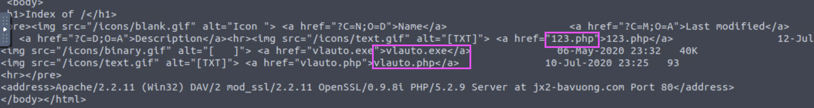

As we can see there are three different files here, one .exe and two .php files.

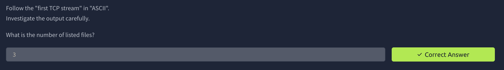

#### Q6 - What is the filename of the first file?:

As we saw from the previous output with the three files, the first was the 123.php file.

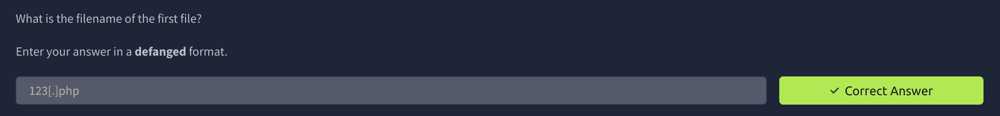

#### Q7 - What is the name of the downloaded executable file?:

Once again, based on the same output, we can see the executable file is named “vlauto”.

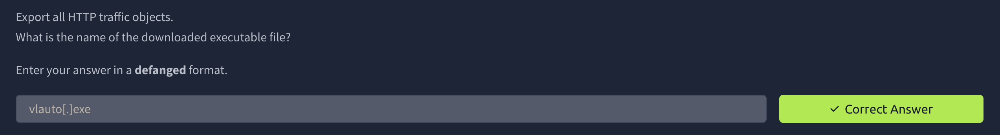

#### Q8 - What is the SHA256 value of the malicious file?:

Running the command `tshark -r directory-curiosity.pcap --export-objects http,/home/ubuntu/Desktop/extracted-by-tshark -q` we export the http files. I then use sha256 sum to find the hash.

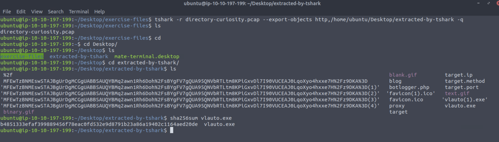

As we can see the hash starts in “b4”.

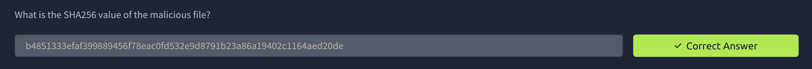

#### Q9 - What is the "PEiD packer" value?:

Let’s take our hash to Virus total and search for it (www.virustotal.com).

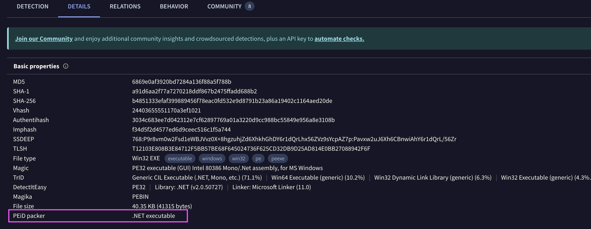

In the “Details” section under “Basic Properties” we can see the PEiD packer value.

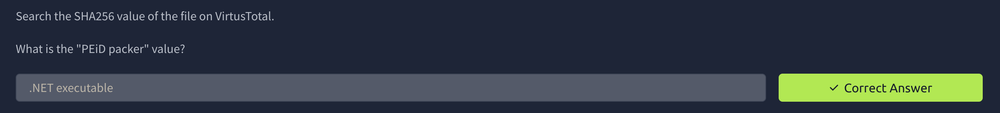

#### Q10 - What does the "Lastline Sandbox" flag this as?:

Back in **Virus Total** if we go under the “Behaviour” tab and scroll down a little we see:

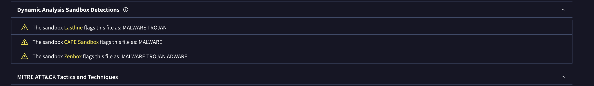

Lastline has flagged the file as a Trojan.

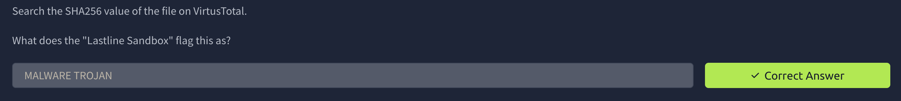

Thank you for reading.

